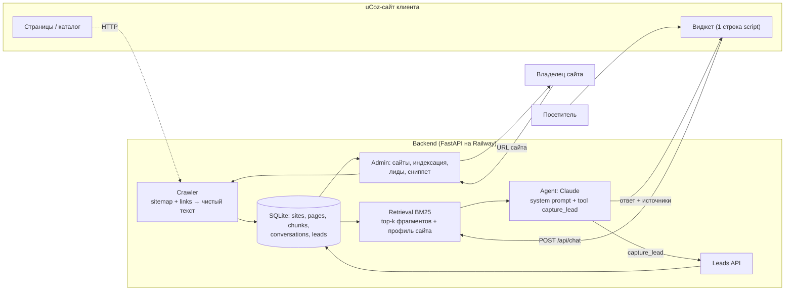

# AI Sales Concierge — технический дизайн MVP

## Компоненты

## Ключевые решения

Retrieval — BM25 по фрагментам (rank_bm25), без векторной БД: сайты uCoz маленькие (десятки–сотни страниц), индекс живёт в памяти и пересобирается из SQLite за секунды; это надёжнее и дешевле для одного дня, а в промпт всегда добавляется «профиль сайта» (главная + контакты), чтобы базовые вопросы отвечались без поиска.

Guardrails — три слоя: (1) системный промпт: отвечать только по переданным фрагментам, цены/сроки/гарантии только дословно из текста, при отсутствии информации сказать честно и предложить контакт; (2) фрагменты передаются как пронумерованные источники, модель ссылается на них, виджет показывает ссылки; (3) если поиск не дал релевантных фрагментов, агент получает явный флаг «контента по вопросу нет».

Квалификация и лид — через tool use: модель вызывает `capture_lead` с полями name, phone, email, need, summary, temperature (hot/warm/cold); backend сохраняет лид и возвращает подтверждение, модель завершает ответ. Вопросы квалификации задаются в конфиге сайта (по умолчанию: что нужно, когда, контакт), модель задаёт по одному, не анкетирует.

Виджет — vanilla JS без зависимостей, стили с префиксом, `conversation_id` в localStorage, быстрые кнопки из конфига сайта, ответы с источниками, индикатор набора. Сниппет: ``.

Установка на uCoz — сниппет вставляется в глобальный блок или в шаблон перед `</body>`: вручную через панель «Управление дизайном» или через uCoz MCP (`templates_tool`) одной командой агенту.

## API

`POST /api/sites` {url, name?} → создать сайт и запустить индексацию (фоновая задача). `GET /api/sites/{id}` → статус, число страниц. `POST /api/sites/{id}/reindex`. `PUT /api/sites/{id}/config` → тон, вопросы квалификации, быстрые кнопки, доп. знания, контакт для handoff. `POST /api/chat` {site_id, conversation_id?, message} → {conversation_id, reply, sources[], lead?}. `GET /api/sites/{id}/leads`, `GET /api/sites/{id}/conversations`. `GET /widget.js?site=ID`. `GET /admin` (token в query/cookie). `GET /demo/{id}` — демо-страница с виджетом (страховка).

## Схема данных

sites(id, url, name, status, pages_count, config_json, created_at) · pages(id, site_id, url, title, text) · chunks(id, site_id, page_id, ord, text) · conversations(id, site_id, messages_json, created_at, updated_at, visitor_meta) · leads(id, site_id, conversation_id, name, phone, email, need, summary, temperature, created_at).

## Нефункциональные

Ответ < 5 с: модель по умолчанию `claude-sonnet-4-5` (переключается через env), max_tokens 600, top-k 8 фрагментов по ~700 символов. CORS `*` для виджета. Простой rate limit по IP. Промпт-кэширование системной части. `LLM_MOCK=1` — режим без ключа для тестов пайплайна.
